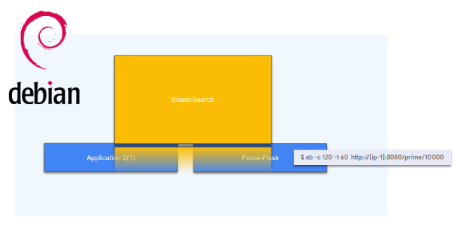
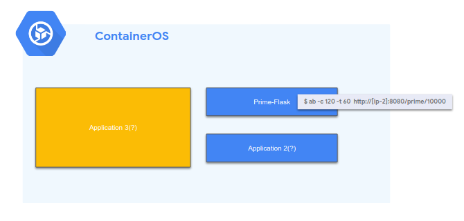
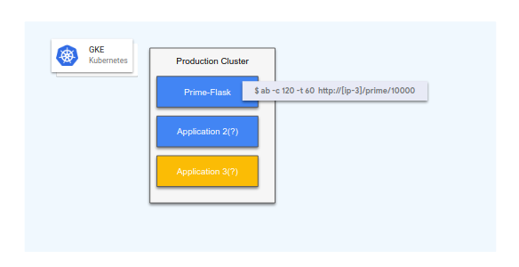
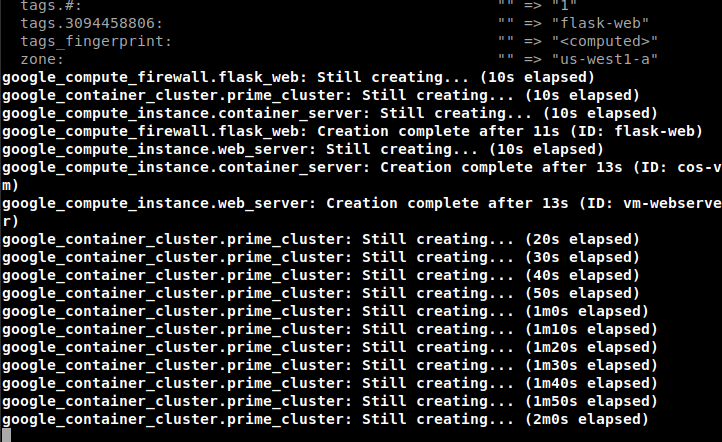
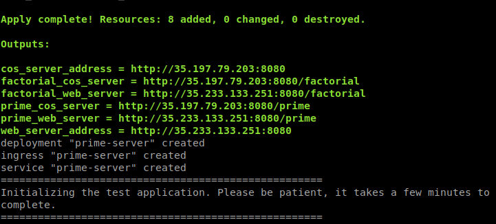
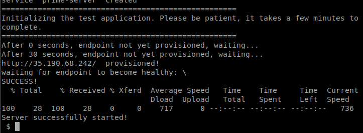
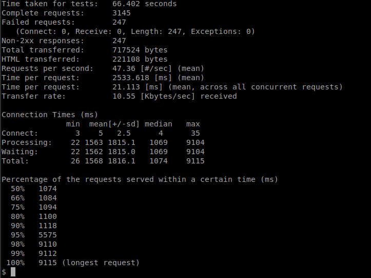
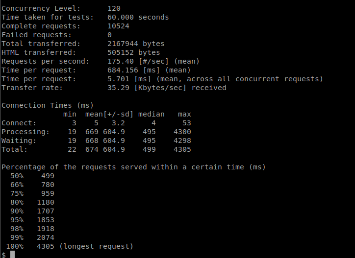
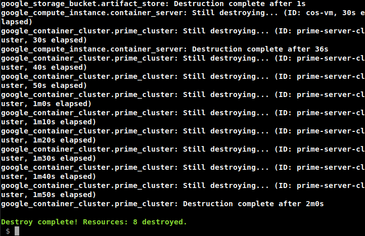

# Migrating to Containers

Containers are quickly becoming the industry standard. The business and technological
advantages of containerizing your workloads are driving many teams towards
moving there applications to containers. This demo provides a basic walkthrough
of migrating a stateless application from running on a VM all the way to running
it on Kubernetes Engine (GKE). This project demonstrates the lifecycle of an
application transitioning from a typical VM/OS based deployment to two
different containerized cloud infrastructure deployments.


## Table of Contents
<!-- TOC -->
* [Table of Contents](#table-of-contents)
* [Introduction](#introduction)
* [Architecture](#architecture)
* [Prerequisites](#prerequisites)
   * [Tools](#tools)
   * [Authenticate gcloud](#authenticate-gcloud)
   * [Configure gcloud settings](#configure-gcloud-settings)
   * [Setup this project](#setup-this-project)
   * [Configuration](#configuration)
* [Deployment](#deployment)
* [Validation](#validation)
* [Load Testing](#load-testing)
* [Tear Down](#tear-down)
* [More Info](#more-info)
* [Troubleshooting](#troubleshooting)
<!-- TOC -->

## Introduction

Containers are superior to conventional deployment mechanism in that they are:

1. Isolated:
  - Applications have their own libraries, no conflicts will arise from
  different libraries in other applications.


2. Limited (limits on CPU/memory):
  - Applications may not hog resources from other applications.


3. Portable:
  - Container contains everything it needs, not tied to an OS or Cloud.


4. Lightweight:
  - The kernel is shared making it much smaller and faster than a full OS image.


This project demonstrates migrating a simple Python application named Prime-flask:

1.  A legacy deployment (Debian VM) where Prime-flask is deployed as the only
    application much like a traditional application was run in an
    on-premises datacenter.
1.  Second, a containerized version is deployed on Container-Optimized OS (COS).
1.  Finally, a Kubernetes deployment where Prime-flask runs as a deployment
    behind a load-balancer cluster in Google Kubernetes Engine.

After the deployment you'll run a load test against the final deployment and
scale it to accommodate the load. If you want to run the application in GKE
in practice you can skip running the application on a VM, and move it to
Kubernetes directly.

## Architecture

**Configuration 1:**


**Configuration 2:**


**Configuration 3:**


A simple Python Flask web application (Prime-flask) was created for this
demonstration which contains two endpoints:

`http://[ip]:8080/factorial/` and

`http://[ip]:8080/prime/`

examples would look like:

```console
curl http://[ip]:8080/prime/10
The sum of all primes less than 10 is 17

curl http://[ip]:8080/factorial/10
The factorial of 10 is 3628800
```

Also included is a utility to validate a successful deployment called
`validate.sh`.


## Prerequisites
### Tools
In order to use the code in this demo you will need access to the following
tools:

* A bash, or bash-compatible, shell
* Access to an existing Google Cloud project with the
[Kubernetes Engine v1.10.0 or later](https://cloud.google.com/kubernetes-engine/docs/quickstart#before-you-begin)
  service enabled
* If you do not have a Google Cloud Platform account you can sign up [here](https://cloud.google.com)
  and get 300 dollars of free credit on your new account.
* [Google Cloud SDK (200.0.0 or later)](https://cloud.google.com/sdk/downloads)
* [ApacheBench](https://httpd.apache.org/docs/2.4/programs/ab.html)
* [HashiCorp Terraform (>= v0.11.7)](https://www.terraform.io/downloads.html)
* [gcloud](https://cloud.google.com/sdk/gcloud/)
* [kubectl](https://kubernetes.io/docs/tasks/tools/install-kubectl/)


### Authenticate gcloud

Prior to running this demo, ensure you have authenticated your gcloud client by running the following command:

```console
gcloud auth application-default login
```

### Configure gcloud settings

Run `gcloud config list` and make sure that `compute/zone`, `compute/region` and `core/project` are populated with values that work for you. You can set their values with the following commands:

Where the region is us-west1:
```console

gcloud config set compute/region us-west1

Updated property [compute/region].
```

 Where the zone inside the region is us-west1-a:
```console

gcloud config set compute/zone us-west1-a

Updated property [compute/zone].
```
 here the project name is my-project-name:
```console

gcloud config set project my-project-name

Updated property [core/project].
```

### Setup this project

This project can be set up simply by executing
```console
./setup.sh
```
from the root of the project.
It will prompt once to enable the required APIs in GCP,
enter `y` when prompted.

### Configuration

The scripts will attempt to initialize themselves with values from the gcloud
config defaults for `compute/zone`, and `core/project`.  If they are not already
set, you can set them with the following commands:

```console
gcloud config set compute/zone <your-zone>
gcloud config set core/project <your-project>
```

## Deployment

At the root of this repository, execute `setup.sh`. It will:
1.  Package the deployable Prime-flask application.
1.  Create the container image and push it to the private image repository
    in your project.
1.  Generate variable defaults for the Terraform execution.
1.  Execute Terraform which creates the three deployments.








## Validation

Validating these three deployments is done by simply executing `validate.sh`
from the root of the directory.
A successful output will contain:
```console
Validating Debian VM Webapp...
Testing endpoint http://[ip-1]:8080
Endpoint http://[ip-1]:8080 is responding.
The sum of all primes less than 10 is 17
The factorial of 10 is 3628800

Validating Container OS Webapp...
Testing endpoint http://[ip-2]:8080
Endpoint http://[ip-2]:8080 is responding.
The sum of all primes less than 10 is 17
The factorial of 10 is 3628800

Validating Kubernetes Webapp...
Testing endpoint http://[ip-3]
Endpoint http://[ip-3] is responding.
The sum of all primes less than 10 is 17
The factorial of 10 is 3628800
```

## Load Testing

In a new console window, execute (using ip-3 from above)
```console
ab -c 120 -t 60  http://[ip-3]/prime/10000
```
ApacheBench (`ab`) will execute 120 concurrent requests against ip-3 for 1
minute. This single replica is insufficient to handle this volume of requests.



This can be confirmed by reviewing the output from the `ab` command. A
"Failed requests" value of more than 0 means that the server couldn't
respond successfully for this amount of load.

A good mechanism for scaling this type of service is via horizontal scaling
(adding additional instances behind a load balancer). For either of the
first two deployments (Debian or COS), this would take several steps:

1.  Create a load balancer.
1.  Create additional instances.
1.  Move all instances behind the load balancer.

This is a very involved process and is out of scope for this demonstration.

For the third (Kubernetes) deployment the process is far easier:

```console
kubectl scale --replicas 3 deployment/prime-server
```

After allowing 30 seconds for the replicas to initialize, re-run.

```console
ab -c 120 -t 60  http://[ip-3]/prime/10000
```
And notice how the "Failed requests" is now 0. This means that all of the 10,000+
requests were successfully answered by the server.



## Tear Down

Deleting the deployments is accomplished by executing `tear-down.sh`. It
will run `terraform destroy` which will destroy all of the resources created
for this demonstration.



## More Info
For additional information see: [Embarking on a Journey Towards Containerizing Your Workloads](https://www.youtube.com/watch?v=_aFA-p87Eec&index=22&list=PLBgogxgQVM9uSqzLOc66kNIZMUOvnGbU4)

## Troubleshooting

Occasionally the APIs take a few moments to complete. Running the `validate.sh`
immediately could potentially appear to fail, but in fact the instances haven't
finished initializing. Waiting for a minute or two should resolve the issue.

The setup of this demo **does** take up to **15** minutes. If there is no error
the best thing to do is keep waiting. The execution of `setup.sh` should **not**
be interrupted.

If you do get an error, it probably makes sense to re-execute failing script.
Occasionally there are network connectivity issues, and retrying will likely
work the subsequent time.

**This is not an officially supported Google product**
